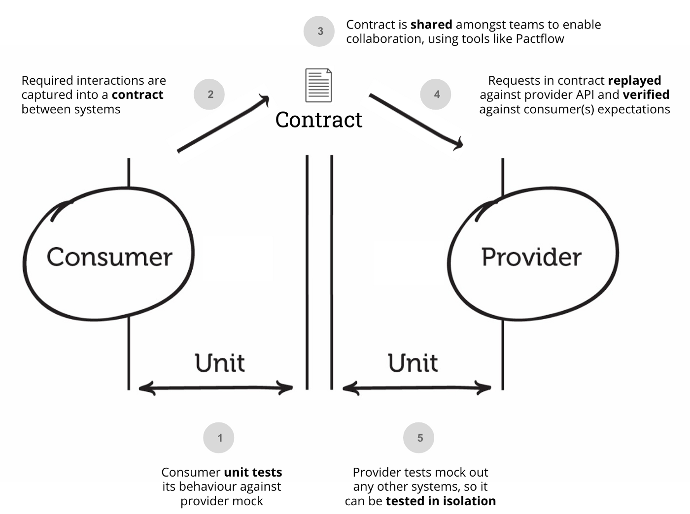

# Vue & Go Simple To-Do List App

# Features
- Todo item can be added 
- Todo list can be listed

# Used Technologies
Go, Pact Go, Mockgen, gorilla/mux

#### APIs

`[POST]` `api/v1/todos` 

`$ curl -H "Content-type: application/json" -X POST -d '{"task":"dummy"}' localhost:3000/api/v1/todos`

`[GET]` `api/v1/todos` 

`$ curl -H "Content-type: application/json" localhost:3000/api/v1/todos`

### How to Run?
>Docker must be installed and running already

Run on command line `docker-compose up` in the root project folder
Backend side will work on 3000 port you can access on your browser
> sample: localhost: 3000/api/v1/todos

### CDC 

