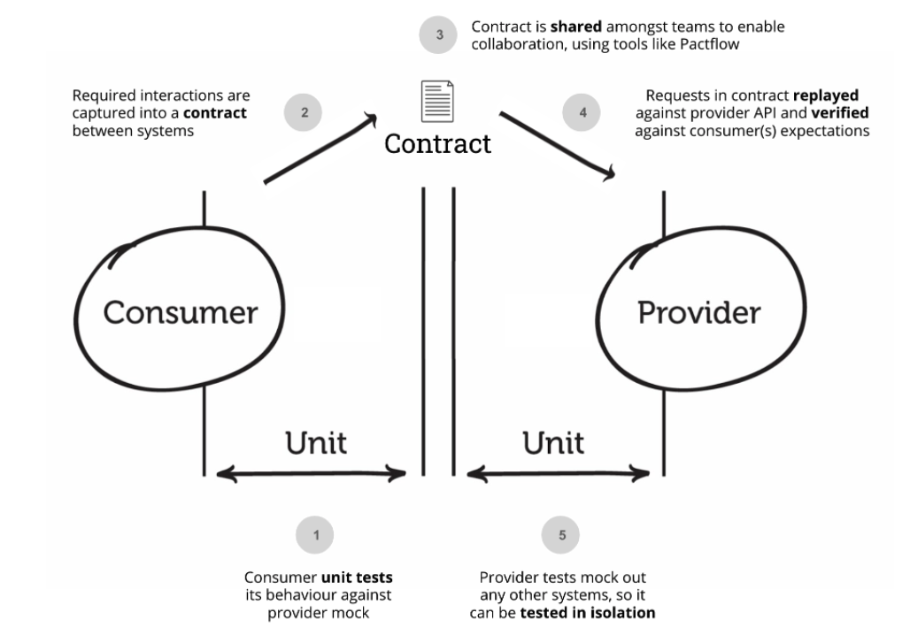

# Vue & Go Simple To-Do List App

# Features

- [x] 1- Todo item can be added
- [x] 2- Todo list can be listed

## Tech Stack

<ol>
<li>GoLang (backend)
    <ol>
        <li>gorilla/mux (routing)</li>
        <li>mockgen (test framework)</li>
        <li>testify (test framework)</li>
        <li>Pact Go (test framework)</li>
        <li>PactFlow (contract testing)</li>
        <li>map for in-memory database</li>
        <li>build tags for go compiler [dev, prod, testenv]</li>
    </ol>
</li>
<li>3-Tier Architecture</li>
<li>RestFULL Api</li>
<li>Nginx (Web server)</li>
<li>Docker && Docker-Compose</li>
<li>Gitlab CI/CD Pipeline(CI)</li>
</ol>

### Consumer Driven Contract

#### APIs

`[POST]` `api/v1/todos` 

`$ curl -H "Content-type: application/json" -X POST -d '{"task":"dummy"}' localhost:3000/api/v1/todos`

`[GET]` `api/v1/todos` 

`$ curl -H "Content-type: application/json" localhost:3000/api/v1/todos`

### How to Run?
>Docker must be installed and running already

Run on command line `docker-compose up` in the root project folder
Backend side will work on 3000 port you can access on your browser
> sample: localhost: 3000/api/v1/todos

### OR 
you can reach backend - https://modanisa-backend-todo-app.herokuapp.com/api/v1/todos

